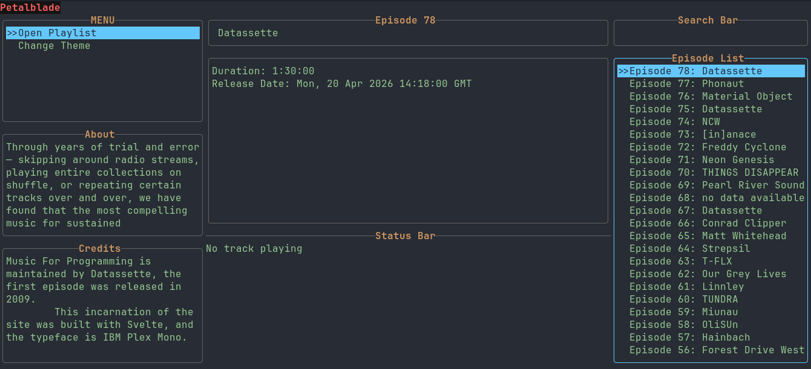

# Petalblade



A TUI for streaming music from [musicforprogramming.net](https://musicforprogramming.net).

## Features

*   Browse and play episodes from the musicforprogramming.net RSS feed.

## How to Use

1.  Clone the repository:
    ```sh
    git clone https://github.com/your-username/petalblade.git
    ```
2.  Build the project:
    ```sh
    cargo build --release
    ```
3.  Run the application:
    ```sh
    ./target/release/petalblade
    ```

## Keybindings

*   `q`, `Esc`: Quit the application.
*   `Tab`: Cycle focus between Menu, Episode List, About, and Credits sections.
*   `Up`/`Down`: 
    *   Navigate lists (Menu, Episode List).
    *   Scroll text (About, Credits).
*   `Enter`: Play the selected episode (when Episode List is focused).
*   `Space`: Pause/Resume playback.
*   `s`: Stop playback.
*   `+`/`-`: Increase/Decrease volume.

## License

This project is licensed under the MIT License.
