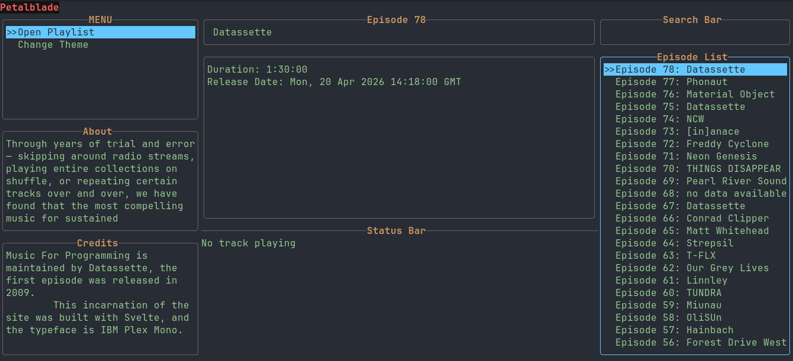

# Petalblade



A TUI for streaming music from [musicforprogramming.net](https://musicforprogramming.net).

## Features

*   Browse and play episodes from the musicforprogramming.net RSS feed.
*   Real-time episode search and filtering.
*   Favorite episodes and filter the catalog to favorites.
*   Persist volume, favorites, and the current episode selection between sessions.
*   Built-in help menu.

## How to Use

### Install from Git

```sh
cargo install --git https://github.com/LorenzoEvans/petalblade.git
```

Then run:

```sh
petalblade
```

### Build from Source

1.  Clone the repository:
    ```sh
    git clone https://github.com/LorenzoEvans/petalblade.git
    cd petalblade
    ```
2.  Build the project:
    ```sh
    cargo build --release
    ```
3.  Run the application:
    ```sh
    ./target/release/petalblade
    ```

## Requirements

*   Rust 1.85 or newer.
*   Network access to `musicforprogramming.net`.
*   A working system audio output. On Linux, install the development/runtime packages for your audio stack if playback fails, such as ALSA or PipeWire/PulseAudio compatibility packages.

## Keybindings

*   `q`: Quit the application.
*   `h`, `?`: Toggle the help menu.
*   `/`: Enter search mode.
*   `Esc`: Exit search mode / Close help / Quit (if not in search/help).
*   `Tab`: Cycle focus between UI sections.
*   `Up`/`Down`: 
    *   Navigate lists (Menu, Episode List).
    *   Scroll text (About, Credits).
*   `Enter`: Play the selected episode (when Episode List is focused).
*   `Enter`: Select all episodes or favorites (when Menu is focused).
*   `Space`: Pause/Resume playback.
*   `s`: Stop playback.
*   `f`: Favorite/unfavorite the selected episode.
*   `F`: Toggle favorites-only filtering.
*   `+`/`-`: Increase/Decrease volume.

## Local Configuration

Petalblade stores user settings in the platform configuration directory under `petalblade/config.toml`. The file contains the saved volume, favorites, favorites-only filter state, and last selected episode.

## License

This project is licensed under the MIT License.
